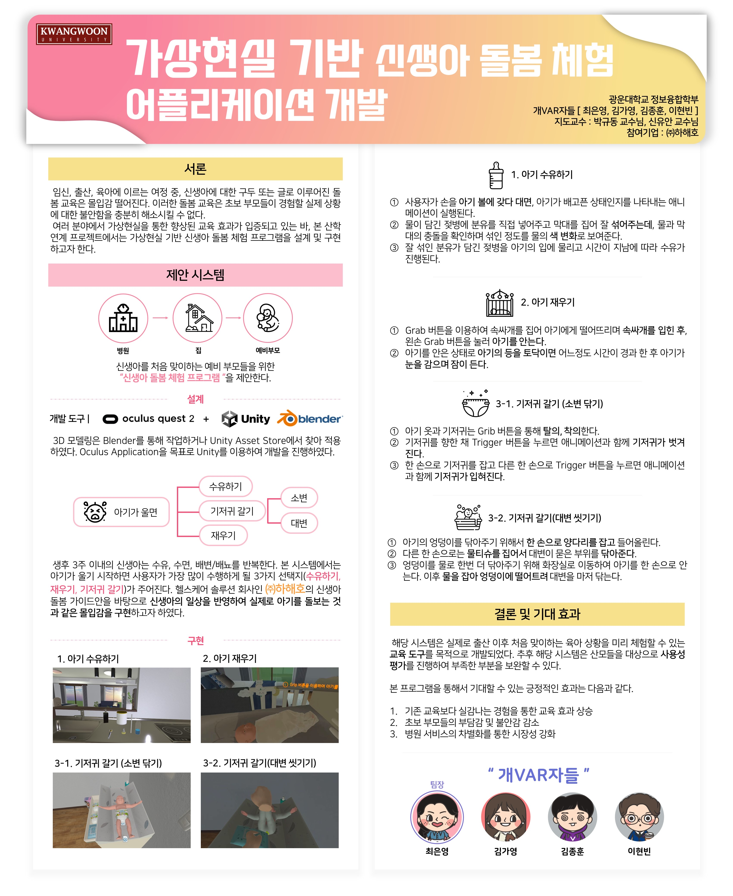
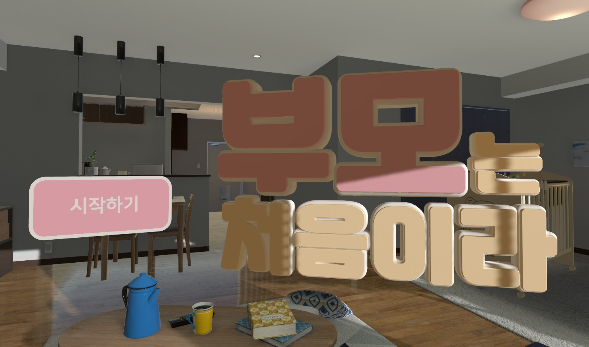

# 👶 가상현실 기반 신생아 돌봄 체험 어플리케이션

## Newborn Care Simulation Application on Virtual Reality

### 2021 - 2022 광운대학교 SW 산학연계 프로젝트
###### 지도교수
- 박규동 교수님
- 신유안 교수님
###### 개VAR자들
- 최은영
- 김가영
- 김종훈
- 이현빈
###### 참여기업
- (주)하해호
---

> 산후 조리원에서 퇴소하는 부모들을 위한 신생아 돌봄 체험 및 교육

### 배경
- 기존 퇴소 교육의 한계
  + 낮은 교육 몰입도
  + 반복적인 학습 불가능
  + 피교육자들의 불안감 해소 불가
- 사용자 경험 중심의 서비스 설계 및 비즈니스 모델 개발의 필요성

### 목적
- 육아 지식이 부족한 초보 부모들에게 VR 콘텐츠의 높은 몰입감과 현실감을 통해 아기를 돌보는 상황을 체험할 수 있는 기회를 제공하는 것
- 신생아 육아 지식에 대한 교육 효과를 극대화하여 실제 상황에서 능동적으로 대처할 수 있는 능력을 함양하고 심리적인 불안감을 해소

### 개발 내용
- 시나리오에 필요한 에셋을 Blender를 통해 모델링
- 스토리보드를 반영한 각각의 상황마다 알맞은 장소와 사용자가 수행할 수 있는 상호작용에 대해 구현
  + 아기 재우기
  + 아기의 기저귀 갈기
  + 수유 및 트림시키기
  + 아기 씻기기

- 사용자 움직임에 대응하는 가상 환경 객체 정의
  - XR ORIGIN
    - BaseController
        > RayInteractor | Grab을 하기 위한 Raycaster
        >
        > XRController | Controller 하드웨어와 다른 버튼 맵핑을 위한 기본적인 컴포넌트
        >
    - TeleportController
        > RayInteractor | Teleport Anchor를 하기 위한 Raycaster
        > 
        > XRController | 조이스틱 Up 으로 텔레포트를 하기 위함
        >
- 유니티 구조에서의 전역 변수 처리를 통한 이벤트 처리
  - Singleton Pattern 개념의 GV class
    > StageState | 시나리오 진행을 위한 Stage 상태 변수
    > BabyState | 아기의 애니메이션 상태 변수

### 개발 환경

##### 개발 도구
- Unity
- Blender

##### 프로젝트 관리
- Notion
- Invision
- Plastic SCM

### 소스 요약
> /Scripts/Controller/
- Controller
  - XR ORIGIN 내부에 RayInteractor와 XRController를 상속받은 Scripts
- Teleport
  - Teleport Anchor를 활용하기 위한 Scripts

> /Scripts/Scenario/
- BabyPee
  - 소변을 본 아기의 기저귀를 갈아주는 Scripts
- BabySleep
  - 아기를 재우기 위한 Scripts
- BabyStart
  - 사용자가 VR기기 조작을 익히기 위한 가이드 Scripts
- BabyWash
  - 아기를 씻기는 과정이 구현된 Scripts
- Baby_Nursing
  - 아기에게 수유하고 트림 시키는 Scripts
- Diper
  - 기저귀를 가는 단계를 세부적으로 나눈 Scripts

### 결과 영상
https://www.youtube.com/watch?v=CQG96e96ryk
 ---

 
 
 
